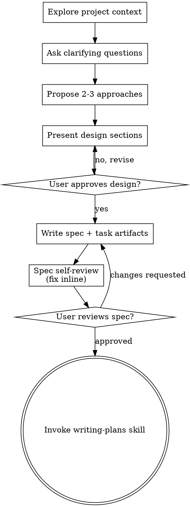

# Brainstorming Ideas Into Designs

Help turn ideas into fully formed designs and specs through natural collaborative dialogue.

Start by understanding the current project context, then ask questions one at a time to refine the idea. Once you understand what you're building, present the design and get user approval.

<HARD-GATE>
Do NOT invoke any implementation skill, write any code, scaffold any project, or take any implementation action until you have presented a design and the user has approved it. This applies to EVERY project regardless of perceived simplicity.
</HARD-GATE>

## Anti-Pattern: "This Is Too Simple To Need A Design"

Every project goes through this process. A todo list, a single-function utility, a config change — all of them. "Simple" projects are where unexamined assumptions cause the most wasted work. The design can be short (a few sentences for truly simple projects), but you MUST present it and get approval.

## Checklist

You MUST create a task for each of these items and complete them in order. Each step is its own stage — complete it fully (including any user confirmations) before moving to the next:

1. **Explore project context + spec discovery** — check files, docs, recent commits. Also check if `.superharness/spec/` needs updating (see Spec Discovery below)
2. **Start mindmap visualization** — invoke `superharness-mindmap` to start the visualization server (see Mindmap Visualization below)
3. **Ask clarifying questions** — one at a time, understand purpose/constraints/success criteria. After each round, update the mindmap.
4. **Propose 2-3 approaches** — with trade-offs and your recommendation. Update mindmap with chosen approach.
5. **Present design** — in sections scaled to their complexity, get user approval after each section. Update mindmap with confirmed design.
6. **Write spec + task artifacts** — save spec to `.superharness/tasks/{MM}-{DD}-{name}/prd.md`, create `task.json` and `contract.md` in the same directory, commit all files
7. **Spec self-review** — quick inline check for placeholders, contradictions, ambiguity, scope (see below)
8. **User reviews written spec** — ask user to review the spec file before proceeding
9. **Transition to implementation** — invoke `superharness-writing-plans` skill to create implementation plan

## Lite Profile Deviations

When entering via lite profile (go args start with `[lite]`), deviate from the checklist as follows; everything not listed stays unchanged:

- Skip the spec-discovery part of step 1 and all of step 2 (mindmap); still explore project context (files, docs, recent commits). Clarifying questions and design approval happen as usual.
- Write the same three artifacts; add `"profile": "lite"` to task.json.
- Worktree decision (concurrency check): scan `.superharness/tasks/*/task.json` for an in-progress task whose `worktree_path` points at this checkout. If one exists, invoke superharness-using-git-worktrees to create a worktree (it writes `worktree_path` back). Otherwise set `worktree_path` to this checkout's absolute path — main-checkout direct edit.
- Ending: do NOT invoke writing-plans. Inline 1-3 tasks and `sprint.total` into task.json, derive acceptance criteria from prd.md, set `phase` to `"implement"`.

## Process Flow



**The terminal state is invoking writing-plans.** Do NOT invoke frontend-design, mcp-builder, or any other implementation skill. The ONLY skill you invoke after brainstorming is `superharness-writing-plans`.

## Spec Discovery (Step 1)

Invoke `superharness-spec-discover` to scan the project and update `.superharness/spec/` if needed. The spec-discover skill handles all the logic — detecting whether specs are skeletons or populated, scanning the codebase, presenting findings, and writing after user confirmation.

Do NOT duplicate spec discovery logic here. Just invoke the skill and wait for it to complete before moving on.

**Stage boundary:** Spec discovery is a self-contained sub-flow that may require user confirmation (e.g., "Save these to spec?"). Do not proceed to Step 2 until spec-discover has fully completed — including any user confirmations it requires. If spec-discover asks the user a question, wait for their answer and let spec-discover finish before continuing the brainstorm flow.

## Mindmap Visualization (Step 2)

Start the mindmap server early in the brainstorm process so the user can see the design evolve visually.

### Starting

After exploring project context (Step 1), invoke the `superharness-mindmap` skill. The mindmap skill handles server startup internally -- do NOT call the script directly from brainstorm.

Simply invoke `superharness-mindmap` and it will start the server and return `{url, content_dir}`.

Save the returned `url` and `content_dir`. Tell the user:
> "I've started a visualization server. Open {url} in your browser to see the mindmap evolve as we clarify the design."

### Updating

After each clarification round, overwrite `current.mmd` with updated Markdown heading hierarchy:

```bash
cat > "$content_dir/current.mmd" << 'EOF'
# 项目名称
## 已确认功能
### 功能 A
### 功能 B
## 待讨论
### 功能 C (讨论中)
## 技术选型
### React + Zustand
### Node.js API
EOF
```

Always overwrite the same file `current.mmd`. The browser smoothly re-renders with animation transition, no page reload.

### What to Show

The mindmap should reflect the **current state of understanding**:
- `#` root = project name
- `##` branches = major modules/features
- `###` leaves = specific features, decisions, constraints
- Mark unresolved items with "(待定)" or "(讨论中)"
- Mark confirmed items clearly
- Include key technical decisions

Use Chinese for all node names. Update after each clarification exchange. User can fold/unfold branches and zoom to explore.

### When to Skip

Skip the mindmap for truly trivial projects (single function, config change). The test: will the user benefit from seeing a visual overview? If the design fits in 3 sentences, skip it.

## The Process

**Understanding the idea:**

- Check out the current project state first (files, docs, recent commits)
- Before asking detailed questions, assess scope: if the request describes multiple independent subsystems (e.g., "build a platform with chat, file storage, billing, and analytics"), flag this immediately. Don't spend questions refining details of a project that needs to be decomposed first.
- If the project is too large for a single spec, help the user decompose into sub-projects: what are the independent pieces, how do they relate, what order should they be built? Then brainstorm the first sub-project through the normal design flow. Each sub-project gets its own spec, plan, and implementation cycle.
- For appropriately-scoped projects, ask questions one at a time to refine the idea
- Prefer multiple choice questions when possible, but open-ended is fine too
- Only one question per message - if a topic needs more exploration, break it into multiple questions
- Focus on understanding: purpose, constraints, success criteria

**Exploring approaches:**

- Propose 2-3 different approaches with trade-offs
- Present options conversationally with your recommendation and reasoning
- Lead with your recommended option and explain why

**Presenting the design:**

- Once you believe you understand what you're building, present the design
- Scale each section to its complexity: a few sentences if straightforward, up to 200-300 words if nuanced
- Ask after each section whether it looks right so far
- Cover: architecture, components, data flow, error handling, testing
- Be ready to go back and clarify if something doesn't make sense

**Design for isolation and clarity:**

- Break the system into smaller units that each have one clear purpose, communicate through well-defined interfaces, and can be understood and tested independently
- For each unit, you should be able to answer: what does it do, how do you use it, and what does it depend on?
- Can someone understand what a unit does without reading its internals? Can you change the internals without breaking consumers? If not, the boundaries need work.
- Smaller, well-bounded units are also easier for you to work with - you reason better about code you can hold in context at once, and your edits are more reliable when files are focused. When a file grows large, that's often a signal that it's doing too much.

**Working in existing codebases:**

- Explore the current structure before proposing changes. Follow existing patterns.
- Where existing code has problems that affect the work (e.g., a file that's grown too large, unclear boundaries, tangled responsibilities), include targeted improvements as part of the design - the way a good developer improves code they're working in.
- Don't propose unrelated refactoring. Stay focused on what serves the current goal.

## After the Design

**Writing Spec and Task Artifacts:**

When the user approves the design, create the task directory and write three files:

1. **Spec (prd.md):** Write the validated design to `.superharness/tasks/{MM}-{DD}-{name}/prd.md`
   - `{MM}-{DD}` is the current date (zero-padded month and day)
   - `{name}` is a short kebab-case identifier for the topic (e.g., `04-03-auth-system`)

2. **Task metadata (task.json):** Create `.superharness/tasks/{MM}-{DD}-{name}/task.json` with initial state:
   ```json
   {
     "name": "{name}",
     "title": "Human-readable title from the spec",
     "status": "planning",
     "phase": "brainstorm",
     "worktree_path": null,
     "sprint": {
       "current": 0,
       "total": 0
     },
     "created_at": "ISO date",
     "updated_at": "ISO date"
   }
   ```

3. **Contract (contract.md):** Create `.superharness/tasks/{MM}-{DD}-{name}/contract.md` with an initial Done Definition derived from the spec's success criteria. This will be refined when the plan is written.

   The Done Definition lists **project-specific acceptance criteria** derived from the spec — not process gates (reviewer verdicts, E2E pass, etc. are enforced by the workflow, not by the contract). List each criterion individually:
   ```
   ## Done Definition
   - [ ] {criterion 1 from prd.md — e.g., "User can create an RFP and see a success dialog"}
   - [ ] {criterion 2 from prd.md — e.g., "Empty list shows empty state illustration"}
   - [ ] {criterion N...}
   ```

   Each item should be a specific, testable condition from the spec — not a blanket "all criteria pass". The writing-plans skill will refine this list based on the plan's task structure, and e2e-gen will cross-check these criteria to ensure E2E case coverage.

4. **Commit all files to git** — `prd.md`, `task.json`, and `contract.md`.

**Spec Self-Review:**
After writing the spec document, look at it with fresh eyes:

1. **Placeholder scan:** Any "TBD", "TODO", incomplete sections, or vague requirements? Fix them.
2. **Internal consistency:** Do any sections contradict each other? Does the architecture match the feature descriptions?
3. **Scope check:** Is this focused enough for a single implementation plan, or does it need decomposition?
4. **Ambiguity check:** Could any requirement be interpreted two different ways? If so, pick one and make it explicit.

Fix any issues inline. No need to re-review — just fix and move on.

**User Review Gate:**
After the spec review loop passes, ask the user to review the written spec before proceeding:

> "Spec written and committed to `.superharness/tasks/{MM}-{DD}-{name}/prd.md`. Task artifacts (task.json, contract.md) created. Please review the spec and let me know if you want to make any changes before we start writing out the implementation plan."

Wait for the user's response. If they request changes, make them and re-run the spec review loop. Only proceed once the user approves.

**Implementation:**

- Invoke the `superharness-writing-plans` skill to create a detailed implementation plan
- Do NOT invoke any other skill. `superharness-writing-plans` is the next step.

## Key Principles

- **One question at a time** - Don't overwhelm with multiple questions
- **Multiple choice preferred** - Easier to answer than open-ended when possible
- **YAGNI ruthlessly** - Remove unnecessary features from all designs
- **Explore alternatives** - Always propose 2-3 approaches before settling
- **Incremental validation** - Present design, get approval before moving on
- **Be flexible** - Go back and clarify when something doesn't make sense

## Red Flags

- Jumping to implementation before the user approves the design
- Skipping the spec self-review after writing prd.md
- Forgetting to create task.json or contract.md alongside the spec
- Invoking any skill other than `superharness-writing-plans` after spec approval
- Writing a spec that covers multiple independent subsystems without decomposing first
- Combining multiple questions into one message
